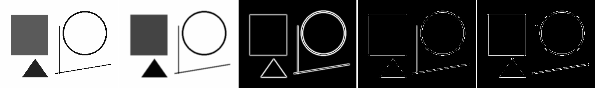
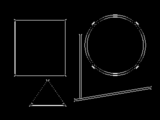

# edgekit

The **Canny edge detector built from scratch in NumPy** — no OpenCV, no SciPy.
Every stage of the classic algorithm is a small, readable function, so you can
see exactly how an edge map is produced from raw pixels.


*input · Gaussian blur · Sobel gradient · non-max suppression · final edges — all computed in NumPy.*

## The pipeline

```
input → Gaussian blur → Sobel gradient → non-max suppression → double threshold → hysteresis → edges
```

Run it on the bundled sample (a fresh clone runs offline):

```bash
pip install -r requirements.txt   # numpy + pillow
python -m edgekit --image sample_data/shapes.png --montage montage.png
```

The montage shows each stage left-to-right —
**input · blurred · gradient magnitude · thinned (NMS) · final edges**:


Final edge map only:



## How each stage works

| Stage | Function | Idea |
|-------|----------|------|
| Blur | `gaussian_blur` | smooth out noise so it isn't detected as edges |
| Gradient | `sobel_gradients` | Sobel operators → gradient magnitude + direction |
| Thin | `non_max_suppression` | keep a pixel only if it's a local max **along** the gradient → 1-px ridges |
| Threshold | `double_threshold` | classify pixels as strong / weak / none |
| Connect | `hysteresis` | keep weak edges only if linked (8-connectivity) to a strong one |

The convolution itself (`correlate2d`) is vectorised with NumPy stride tricks —
no Python loop over pixels — so it stays fast without external libraries.

## Tests

```bash
pip install pytest
pytest -q          # 5 passed
```

Tests use synthetic inputs with known answers: a normalised Gaussian kernel, an
identity-kernel sanity check, a Sobel response on a step edge, NMS thinning a
gradient ridge, and Canny tracing a square's outline (not its interior).

## Why I built it

A traffic-sign or industrial-defect CV system leans on edges and gradients long
before any neural network. This is my from-scratch reference for what
`cv2.Canny` actually does under the hood — and a clean place to reason about
kernels, gradients, and non-max suppression.

## License

MIT — see [LICENSE](LICENSE).
